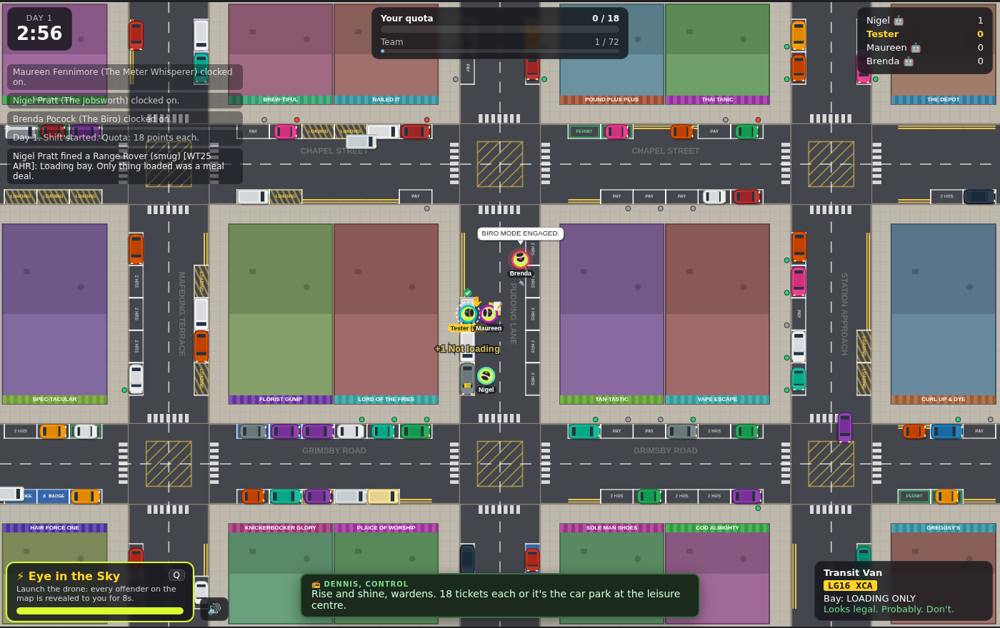

# Fine Print 🅿️📝

*A parking warden game of quotas, clipboards and questionable conduct.*



A browser game where you play one of 14 sparky, awkward parking wardens.
You have one shift to hit your ticket quota. Inspect cars, write tickets,
dodge complaints and use your special ability. You can also high-five your
colleagues, sabotage them, or both.

Play solo with AI colleagues, or with up to 8 players over the network.

## Run it

Requires Node 18+ (22+ to run the server test). There are **no dependencies**.

```bash
cd parking-warden
npm start               # http://localhost:8080  (PORT=3000 npm start to change)
```

Open the URL, pick a warden and **Clock on** for solo. For multiplayer, click
**Create room** and share the link or 4-letter code with friends on the same
server.

> Solo mode is purely client-side, so any static host works for it (e.g.
> `npx serve .` or GitHub Pages). Multiplayer needs `npm start`, which serves
> the game and runs the WebSocket rooms.

### Play on a phone

* **Same Wi-Fi:** run `npm start` on your computer and open
  `http://<your-computer's-LAN-IP>:8080` on the phone. Multiplayer works too.
* **Single file:** `npm run build` writes `dist/fine-print.html`, a
  self-contained solo build with no server or imports. Host it anywhere or open
  it from disk.

On phones the camera zooms in and follows your warden. There's a thumb stick
plus Ticket, Ability and High-5 buttons, and a compact HUD for portrait and
landscape.

## How to play

| Key | Action |
| --- | --- |
| `WASD` / arrows | Patrol |
| hold `E` | Write a ticket for the nearest car (stand still!) |
| `Q` / `Space` | Special ability |
| `F` | Offer a high-five (needs a colleague to press `F` too) |
| `M` | Mute |
| `Esc` | Clock off (press twice) |

Touch devices get an on-screen stick and buttons.

* Walk near a car to inspect it. A **red badge** marks an offence, a **green
  tick** marks a legal car. The bottom-right card shows the model, plate, bay
  type and meter status.
* Offences: double yellows, bus stops (2 pts), blue badge bays without a badge
  (2 pts), permit bays without a permit, loading bays without a van, and
  expired pay & display meters. Meters run out *during* the shift, so the
  same car can become fair game later.
* Ticketing a legal car earns a **complaint** (−1 point and a radio telling-off
  from Dennis in Control).
* If a driver comes back while you're mid-scribble, they **escape**.
* A mutual high-five gives both wardens +1 and a speed boost. A one-sided
  high-five gets you left hanging, and the end-of-shift awards notice.
* **Mid-shift events:** two random events interrupt every shift, each with a
  banner and a radio call from Dennis:
  * 🕵️ **Council Inspection**: Inspector Hargreaves looms behind the nearest
    warden. Tickets score double and complaints cost 3.
  * 💒 **Wedding Convoy**: six ribboned cars dumped on double yellows and bus
    stops, worth +2 each.
  * 🍦 **Rogue Ice Cream Van**: parks illegally, plays Greensleeves and moves
    every 9 seconds. Worth +4 if you catch it.
  * 🌧️ **Sudden Downpour**: writing is 50% slower and drivers sprint back.
  * 🚸 **School Run**: spawn rate ×3, and most new arrivals park illegally.
* Each shift lasts 3 minutes. Your quota starts at 18 points and goes up by 3
  every day. Dennis writes a performance review for everyone at the end.

## The wardens

| Warden | Ability |
| --- | --- |
| Brenda Pocock, *The Biro* | **Rapid Scrawl**: near-instant tickets for 6s |
| Kevin Dimmock, *The Small-Talker* | **Awkward Chat**: freezes nearby drivers in small talk |
| Gordon Clamp, *Clampy* | **Wheel Clamp**: +2 pts, driver stuck fuming |
| Tariq "Nudge" Nadeem | **Creative Repositioning**: shoves a car onto double yellows |
| Maureen Fennimore, *Meter Whisperer* | **Sweet Nothings**: nearby meters expire |
| Declan Rafferty, *Freelance Line Painter* | **Fresh Lines**: paints double yellows under a parked car |
| Nigel Pratt, *The Jobsworth* | **Procedural Lecture**: stuns rival wardens |
| Priya Chandra, *Drone Operator* | **Eye in the Sky**: reveals every offender on the map |
| Sandra Bassett, *Tea Lady* | **Tea Break**: urn that buffs everyone nearby, rivals included |
| Derek Bright, *Hi-Vis Enthusiast* | **Retina Burn**: blinds and slows rivals |
| Colin Pyle, *Cone Man* | **Cone Zone**: cones that trip rival wardens |
| Agatha Crumb, *The Veteran (81)* | **Seen It All**: next 3 tickets score double |
| Barry Stride, *The Power Walker* | **Power Walk**: 3s of terrifying speed |
| Lionel Grift, *Paperwork Wizard* | **Paperwork Mix-up**: steals a point from a rival |

## Code layout

```
parking-warden/
  index.html          page + menu/HUD markup
  client/             browser: main.js (UI, input, sessions), render.js (canvas), audio.js (synth blips)
  shared/sim.js       the authoritative game simulation, same code in browser and Node
  shared/content.js   characters, barks, excuses, radio chatter: all the jokes live here
  server/             zero-dependency HTTP + WebSocket server with rooms
  scripts/            build-standalone.mjs bundles solo mode into one HTML file
  test/               node:test suites for the sim and a live server round-trip
  docs/DESIGN.md      pillars, loop, roadmap
```

**Architecture:** `Game` in `shared/sim.js` is a plain class: `addWarden`,
`setInput`, `useAbility`, `high5`, `step(dt)`, `snapshot()`. Solo runs it in
the browser every frame. Multiplayer runs it on the server at 30 Hz and
broadcasts snapshots at 15 Hz, which clients smooth between. Adding content
(a new warden, bark or excuse) is usually a single edit to `content.js`.
New abilities go in `abilityEffects` in `sim.js`.

```bash
npm test
```

Dev URL parameters for solo: `?shift=30` (a 30-second shift) and
`?event=inspection` (fire an event 2s in; ids: `inspection`, `wedding`,
`icecream`, `rain`, `rushhour`).
